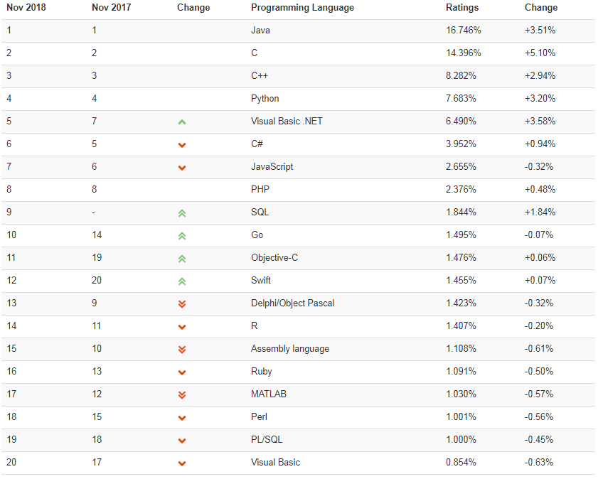

=================
00_python简单介绍
=================

1. python的由来
=================

Python最初是由Guido van Rossum在1989年圣诞节期间编写的。由于Python创始人Guido van Rossum于20世纪80年代曾在ABC系统开发中工作了数年。
所以这门语言诞生的初衷是作为ABC语言的一种继承。

近几年来，由于人工智能话题的不断深入，越来越多的企业将目光投放在这一块领域中。Python借此机会也大展才能，且由于python代码简单优美的特点，受到越来越多的人关注和使用。
我们可以从以下榜单看出些许眉目（榜单来源：2018年10月编程语言排行榜）

